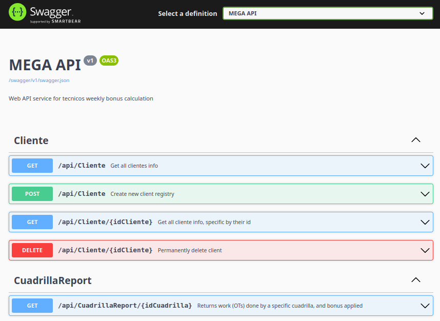

# API Documentation

## Configuration

Go to `appsettings.json` file to add Database connection string:

```json
  "ConnectionStrings": {
    "DefaultConnection": "Server=localhost;Database=MegaHackathon;User Id=sa;Password=YOUR_PASSWORD_HERE;TrustServerCertificate=true;"
  }
```

## Running API

On Terminal, make sure to be located at directory `/backend/Mega`, then run:

```Bash
dotnet run
```

You'll see on a new line with _url + port_ in which the server is listening (_`Now listening on: http://localhost:5009`_).
In your prefered browser, access the url:

```Bash
http://localhost:5009/
```



## Database

Database name: `MegaHackathon`

For _E-R Model_ of our data base, please refer to: [database files directory](../SQLBDHACKATHON/)
