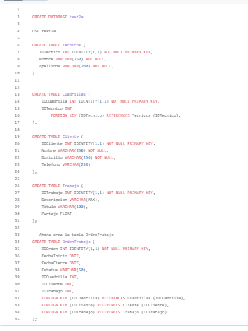

# Proyecto Hackaton

This project was generated with [Angular CLI](https://github.com/angular/angular-cli) version 17.3.8.
Visual Studio 2022 with Net Framework 8.0
Microsoft SQL Server Management

# Integrantes

* Emmanuel Salcedo Davalos
* Karla Julieta Jimenez
* Armando Pineda Gama
* Javier Montaño Rodriguez
* Edgar Hernandez Gonzalez

## Problemática

Realizar un reporte para pago de puntos para técnicos instaladores

## Solución

Aplicacion web que pueden usar en sus celulares la cual genera una orden de trabajo en la que se mostrara su cuartilla asignada, orden de trabajo y al finalizar calculara sus puntos.

## Imagenes del Proyecto

